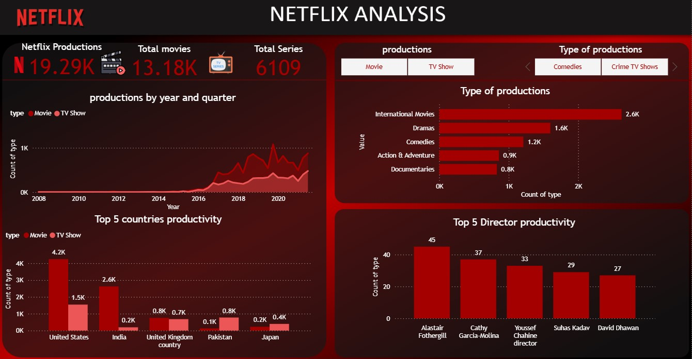

# Netflix Content Analytics Dashboard

**Comprehensive dashboard analyzing 19K+ movies & 13K TV shows across 6K+ directors, visualizing production trends by year/quarter, top countries (USA/India), and genre/directors performance.**

## 📊 Key Features & Metrics
| KPI | Value |
|-----|-------|
| Total Movies | **19.2K** |
| Total TV Shows | **13.1K** |
| Total Directors | **6,109** |
| Top Country | **USA** |

## 🎬 Highlights
- **Quarterly Trends**: Production growth visualization
- **Top Directors**: Martin Scorsese leads
- **Country Analysis**: USA/India dominance

## 🛠️ Tech Stack
- **Power BI** | Advanced bar charts | Country production maps

## 🚀 Get Started
1. Download `Netflix-Content-Analysis.pbix`
2. Open in **Power BI Desktop**
3. Analyze Netflix content strategy!
## 📞 Contact
Have questions about the dashboard or want to collaborate?  
**Email**: Abdelrahman.Gamal.Ai@gmail.com | **LinkedIn**: [linkedin.com/in/yourprofile](https://www.linkedin.com/in/abdelrahman-gamal236/) | **whatsapp**: +201029744194

---
⭐ Star if helpful! 👨‍💻 Built by **[Abdelrahman Gamal]**
